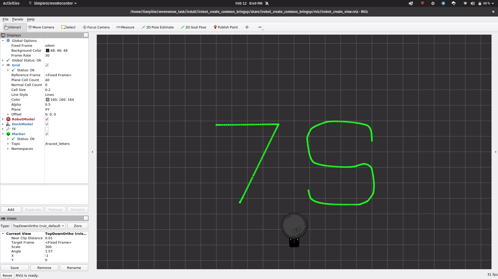
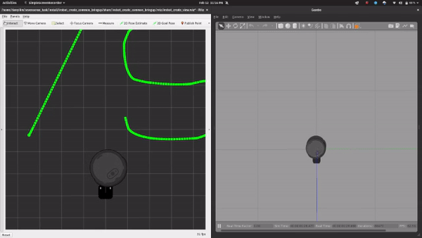

# Coding Submission — Tianyi

## Setup
The following instructions assume Ubuntu 20.04, ROS2 Galactic, and Gazebo 11 has been installed.
1. Clone this repository into a convenient location, for example your home folder.
2. Clone the iRobot Simulator into `src`. Assuming that you cloned this repo into `~/`:
    ```bash
    cd ~/irobot_shape_drawing/src
    git clone git@github.com:iRobotEducation/create3_sim.git -b galactic
    ```
3. Setup dependencies. Do note that ROS2 Galactic is EOL, so add the following when running `rosdep`:
   ```bash
    cd ~/irobot_shape_drawing
    sudo apt update
    rosdep update --include-eol-distros # This allows rosdep to find ROS galactic dependencies
    rosdep install --from-path src -yi
    ```
4. Edit the RViz config file in the Create simulator. This is an easy way to make use of the existing launch files, while displaying output in the way we want.
    ```bash
    cd ~/irobot_shape_drawing
    mv irobot_create_view.rviz src/create3_sim/irobot_create_common/irobot_create_common_bringup/rviz/irobot_create_view.rviz
    ```
5. Build the project:
   ```bash
   cd ~/irobot_shape_drawing
   colcon build --symlink install
   ```
6. In a new terminal source the project.
    ```bash
    cd ~/irobot_shape_drawing
    source install/setup.bash
    ```

## Running
After sourcing the setup (step 6 above), we can run the shape drawing task by running `ros2 launch irobot_command task.launch.py`.

Here is a screenshot of the drawn letters:


[Here on YouTube](https://youtu.be/lGK0zXpr-_0) is an annotated (unlisted) video of the robot moving around.

## Code Structure
The code is structured into two folders, `irobot_command` and `path_viz`. `irobot_command` manages the control of the robot to fulfil tasks, and is written in C++. `path_viz` allows the path of the robot to visualized in RViz and is written in Python.

My solution to this task has four distinct components:
1. Calling the built-in `Undock` action
2. Drawing the letter 7 using the `NavToGoal` actions
3. Drawing the letter S by directly publishing to `cmd_vel`
4. Returning near the dock, then docking using the `DockServo` action.

Each part of the solution is wrapped up in its own node. When a part is done, it sends a message (a std_msgs Bool) to the next node to let it know that it can start, and then shuts down.

For Parts 2 and 3, coordinates to make up the letters were coded out as float vectors, accessed with an index that increments when the robot reaches the current goal coordinate.

For Part 3, the control law for following the S-shaped path relates the requested linear and angular velocities with the current heading error.

The requested linear velocity varies linearly with the absolute heading error, dropping to 0 when the error is too large (the robot should then turn on the spot).

To obtain smoother performance for the angular velocitiy, the sin function is used when the heading error is not too large. If the error is too large, then it is clipped to the maximum (or minimum) angular velocity.

## Notes
When calling the `DockServo` action, the robot does not seem to visually dock with the docking station in RViz. This is probably due to the (simulated) drift of the Odometry frame over time (as it uses just wheel encoders and IMU, no other extereoceptive sensors). In RViz, the base frame is the Odom frame, therefore the docking station and the robot do not line up.

However, in Gazebo, the docking works as intended, as seen here.


The DockServo action aligns the robot using the IR beacons on the docking station, so it would correspond to docking the robot accurately in real life (as in Gazebo).
